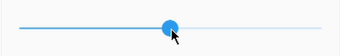

# expandable_slider



A Flutter slider that can be expanded to select values with more precision.

[](https://pub.dartlang.org/packages/expandable_slider)
[](https://app.bitrise.io/app/1cf17bc69d166d73)
[](https://codecov.io/gh/drogel/expandable_slider)


## Features

* The `ExpandableSlider` can have two status: shrunk and expanded.
* When shrunk, `ExpandableSlider` behaves just like a Flutter's discrete `Slider`.
* When expanded, `ExpandableSlider` will always have visible divisions whose spacing will always be enough for the user to move the slider thumb between divisions easily.
* Customizable `min`, `max`, and value change between divisions.
* Customizable expansion, shrinkage and expanded scrolling animations.
* Expansion can be toggled with a long press, a scale gesture, or a double tap.
* Just like Flutter's `Slider`, the appearance can be fully customized with `SliderTheme` and `SliderThemeData`.

## Usage

This package exposes an `ExpandableSlider` stateful widget for you to use wherever
you want, just like a regular `Slider`.

```dart
    Widget build(BuildContext context) => ExpandableSlider(
        value: myValue,
        onChanged: (newValue) => setState(() => myValue = newValue),
        min: 0,
        max: 50,
        estimatedValueStep: 5,
      );
```

By default, the expansion will be toggled with either a long press on the slider or a scale gesture.
Check out the `example` app in the project repository to find out more.

## Getting started

In the `pubspec.yaml` of your flutter project, add the following dependency:

```yaml
dependencies:
  expandable_slider: "^1.0.0"
```

Then run `$ flutter pub get`. In your library, add the following import:

```dart
import 'package:expandable_slider/expandable_slider.dart';
```

## Author

Diego Rogel - [GitHub](https://github.com/drogel)

## Changelog

Check the [Changelog](./CHANGELOG.md) page to see what's recently changed.

## License

This project is licensed under the MIT License - see the [LICENSE.md](LICENSE.md) file for details.